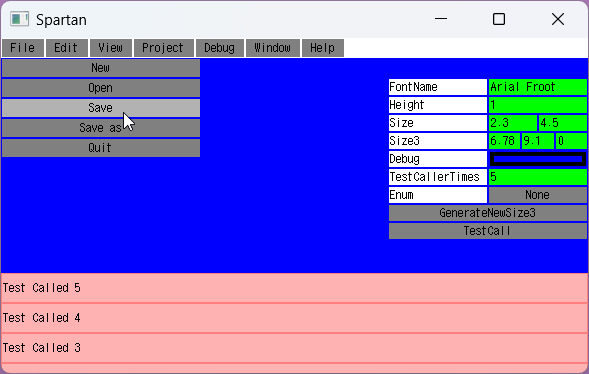

  # Spartan
Extremely ascetic immediate mode GUI library for C#/.Net.  
Cross-platform and simple as a brick.

Spartan uses two layers: main and popup. 
This means you can draw a popup and then draw under it as usual. 
Drawing on the popup layer adds a hover mask so you can distinguish which layer your pointer is hovering over.

Spartan also declares a clip/scroll feature. 
You can clip/scroll on both main and popup layers, which allows you to create scrollable popups.

Although Spartan includes basic implementations of text rendering, text input, buttons, popups, etc., Spartan is more of a blitter with basic drawing/input functions. 
You can create your own elements, your own text rendering etc., after all it's all rectangles.

## Spartan.SFML
Windows implementation of Spartan. Uses the [SFML.Net](https://github.com/SFML/SFML.Net) library.

## Spartan.Web
Spartan.Web is a **Websocket** + **HTML Canvas** implementation of Spartan.
It basically streams inputs to the server and then streams binary instructions of what to draw on the canvas.  
Yes, just like Blazor, WebForms, Remote Desktop and your basic console terminal.
However, there are some optimizations, layout masks and highlighting are handled on the client side and only delta is streamed back.  
It's perfect for utility services and prototyping - no html, no http, no divs.